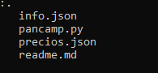

## PANCAMP

 Se desea implementar un sistema integral de gestión que permita manejar todas las operaciones relacionadas con la administración de registros de venta, compra, así como la generación de informes relevantes.

## Tabla De Contenido
| Índice | Título |Descripción|
|--|------|------|
| 1 | Pancamp|Administrador de registros e informes |
| 2 | Info | Informacion de ventas y compras|
| 3 | Precio | Informacion de productos y precios|

## Instalación

Deberas ejecutar el siguiente comando para clonar el repositorio y ver cada uno de los proyectos  desde tu maquina local:
 
Gith Bash

~~~ 
git clone "link del repositorio" https://github.com/YurleyBG/Trabajo_python_YurleyBotello.git
~~~
al hacer esto se descargará  los datos del repositorio. puedes usar visual studio code para correr cada uno de los códigos en la terminal.
Recuerda tener instalado python en tu máquina local.

 ## Tecnología utilizadas

+ Python

## Estructura 

## Crédito 
Este  proyecto para manejo de Git desarrollado por Yurley Botello.